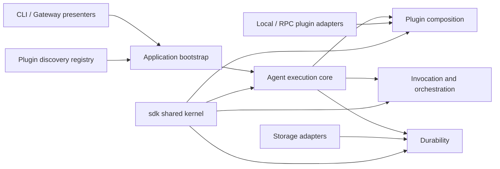

# Architecture and domain map

AgentM is organized by domain ownership first and technical adapters second.
Directories are introduced only when a concept has its own language,
invariants, and independently testable boundary.

## Context map



### Shared kernel: `sdk`

The root `sdk` package contains the stable language and ports shared by
runtimes, plugins, presenters, and infrastructure:

- resource contracts such as `Provider`, `Tool`, `Capability`, and `Agent`;
- plugin contracts such as `Manifest`, `Source`, and `Connection`;
- durable aggregates and ports such as `Operation`, `Trajectory`,
  `Delivery`, and `StateBackend`;
- invocation, workflow, event, and hook values that cross process or package
  boundaries.

The shared kernel is not a general-purpose utility package. Application
orchestration, storage implementations, transport adapters, and helpers with
no public domain meaning do not belong here.

### Core domain: agent execution

`sdk/runtime` is the public execution façade. `Runtime`, `Session`, prompt
submission, recovery, and result types are the entry points for applications.
The core owns the turn loop and coordinates the supporting domains without
depending on concrete storage, registry, or RPC implementations.

### Supporting domain: plugin composition

Composition owns transactional mount and unmount, resource ownership,
staging, immutable catalog snapshots, and generation publication. Discovery
does not belong to this domain: application bootstrap explicitly selects a
discovered source before composition mounts it.

### Supporting domain: invocation and orchestration

Invocation is the recursive execution primitive. Agent calls and workflow DAG
nodes use operation state for retry and cancellation, while trajectories
remain per-agent state branches. Workflow scheduling must not be implemented
by overloading trajectory lineage.

### Supporting domain: durability

`sdk/runtime/internal/durability` owns checkpoint payloads, stable trajectory
field projection, checkpoint lookup, and restore-head validation. Runtime
orchestration decides when to commit, roll back, recover, and emit events.

The public durability ports remain in `sdk`; concrete memory, file, DuckDB,
and PostgreSQL adapters live in `sdk/storage`.

### Discovery bounded context: `registry`

The registry owns plugin instances, leases, revisions, and discovery queries.
It is a control plane. It never mounts a plugin or mutates a running runtime.
The registry implementation is evolving, but this context boundary is stable.

### Gateway bounded context: `gateway`

The gateway owns user sessions, plugin bindings, optimistic revisions, and
asynchronous execution presentation. It invokes the runtime through an
execution backend and does not own the agent turn loop.

## Application entry points

```text
cmd/ag
  -> internal/cli
  -> internal/bootstrap
  -> sdk/runtime

cmd/agentm-plugin-file
cmd/agentm-plugin-bash
  -> internal/pluginhost
  -> pluginrpc
```

The CLI is a presenter. Runtime, storage, telemetry, and selected plugin
sources are composition decisions, not CLI domain behavior. `internal/bootstrap`
owns that application composition boundary: opening state backends, configuring
runtime observability, building plugin plans, selecting discovered plugin
instances, opening plugin inspection catalogs, producing gateway runtime
builders, and wrapping short-lived runtime actions. CLI command handlers should
remain focused on arguments, confirmation, progress presentation, and rendering.

Gateway serving follows the same split. `internal/cli` owns the command process,
HTTP listener lifecycle, and ready output; `internal/bootstrap` owns the
gateway service host, telemetry, durable stores, plugin directory, and runtime
execution backend composition.

Registry serving mirrors that host split: `internal/cli` owns the gRPC listener,
transport flags, advertise URI, and ready output; `internal/bootstrap` owns the
registry backend, telemetry, logger wiring, and host cleanup.

The local CLI progress UI implements `bootstrap.EventSink`; bootstrap adapts it
to `runtime.RuntimeConfig.EventObserver`. This is a host-side diagnostics path:
the runtime sends cloned events after dispatch, while `internal/cli` translates
those events into text, plain progress lines, or the interactive terminal
dashboard. Event interpretation belongs to the presenter; event production and
subscriber delivery remain runtime/plugin concerns. The CLI sink uses a bounded
in-process queue and drains it on shutdown, so terminal rendering does not pace
runtime execution. If local rendering falls behind, the sink reports dropped
progress updates rather than hiding overload. Durable, retryable event delivery
belongs to runtime subscribers, not to the local host UI callback.

## Dependency rules

1. `sdk` imports no runtime, storage, registry, gateway, plugin, or transport
   implementation.
2. `sdk/runtime` depends on `sdk` ports and its own internal domains, never on
   `sdk/storage`, `registry`, or `pluginrpc`.
3. `sdk/storage` implements `sdk` durability ports and owns no agent execution
   policy.
4. `registry` exposes discovery state to application bootstrap; discovery
   never implies execution.
5. `pluginrpc` adapts the wire protocol to SDK ports and selects no concrete
   persistence.
6. `internal/cli` parses commands and renders results; domain rules belong in
   their owning context.

Avoid catch-all packages named `utils`, `common`, `models`, or `helpers`.
A new package must own a coherent language and invariant, not merely reduce
the number of lines in another file.
