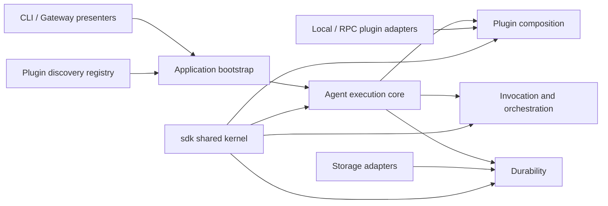

# Architecture and domain map

AgentM is organized by domain ownership first and technical adapters second.
Directories are introduced only when a concept has its own language,
invariants, and independently testable boundary.

## Context map



### Shared kernel: `sdk`

The root `sdk` package contains the stable language and ports shared by
runtimes, plugins, presenters, and infrastructure:

- resource contracts such as `Provider`, `Tool`, `Capability`, and `Agent`;
- plugin contracts such as `Manifest`, `Source`, and `Connection`;
- durable aggregates and ports such as `Operation`, `Trajectory`,
  `Delivery`, and `StateBackend`;
- invocation, workflow, event, and hook values that cross process or package
  boundaries.

The shared kernel is not a general-purpose utility package. Application
orchestration, storage implementations, transport adapters, and helpers with
no public domain meaning do not belong here.

### Core domain: agent execution

`sdk/runtime` is the public execution façade. `Runtime`, `Session`, prompt
submission, recovery, and result types are the entry points for applications.
The core owns the turn loop and coordinates the supporting domains without
depending on concrete storage, registry, or RPC implementations.

### Supporting domain: plugin composition

Composition owns transactional mount and unmount, resource ownership,
staging, immutable catalog snapshots, and generation publication. Discovery
does not belong to this domain: application bootstrap explicitly selects a
discovered source before composition mounts it.

### Supporting domain: invocation and orchestration

Invocation is the recursive execution primitive. Agent calls and workflow DAG
nodes use operation state for retry and cancellation, while trajectories
remain per-agent state branches. Workflow scheduling must not be implemented
by overloading trajectory lineage.

Provider and tool invocations are turn-loop nodes derived from the active
session execution. Agent and workflow child operations are recursive nodes
derived from their parent invocation. Both paths must keep stable IDs,
dependencies, groups, and ordinals in the operation record rather than
reconstructing graph shape from trajectory entries later.
`sdk.LoadInvocationGraph` is the read model boundary for that state: it depends
on the narrow `InvocationGraphStore` read port, backed by
`OperationStore.ListByInvocationRoot`, and projects root, parent/child, and
dependency edges into `InvocationNode` values. Presenters may choose their
rendering, but they must not sort records by wall-clock timing or rebuild DAG
relationships from raw operation metadata.

Synchronous provider, tool, and capability resources are adapted during runtime
composition into durable operation targets. The adapter owns the resource kind,
name, revision binding, and request-to-record projection; the turn loop should
only submit, await, and cancel operations through the async contract. Local
operation targets also own the
composition lease for their background execution, so unmount and runtime close
cannot close a plugin connection while an adapted synchronous resource,
recursive agent call, or workflow node is still unwinding. The retire decision
also records a detached close context, so delayed plugin shutdown preserves
runtime context values without inheriting caller cancellation. Claimed local
operation records are validated against the current target before execution;
records that name a different resource revision fail instead of running against
whatever plugin happens to be mounted now.
Provider terminal completion is a runtime outcome before it is a trajectory
entry: provider invocation, response validation, and future streaming/tool-ready
outcomes must be resolved at the operation boundary. The runtime emits
`provider_outcome` as a live, non-durable observation of the terminal provider
result. Provider outcomes carry an operation-local `sequence` so future content
deltas and tool-ready signals can share the same live ordering model, while
the runtime separately projects `provider_response` entries for durable
fork/resume. Gateway code must not invent alternate provider-response state
because the trajectory projection is the resume source of truth.
Provider retry attempts use trajectory analysis only to initialize the
execution-local attempt counters. Once a prompt execution is live, the runtime
increments those counters in memory instead of using bounded trajectory
analysis as a hot-path counter.

Operation control uses the target identity, not the executable revision.
Polling and execution validate the recorded resource revision because they read
or run revision-specific results. Cancellation validates only kind and resource,
so a caller can still stop or observe a stale-revision operation without
requiring the old plugin implementation to be mounted.
Operation awaiting uses polling as the portable baseline and
`sdk.OperationWatcher` as an optional revision-aware observation path; either
way, observed snapshots must pass the same operation-progress validation. If a
watch returns the unchanged non-terminal snapshot, the runtime falls back to an
immediate poll instead of treating the stale observation as progress.
Standalone operation recovery scheduling starts from the store's non-terminal
view, then the worker layer rechecks lease delay before claiming. Standalone
presenters must not recover only the records that are claimable at startup,
because a still-valid crashed-worker lease needs a delayed recovery plan.
Runtime-local adapted operations are recovered through the owning trajectory or
invocation replay: the replay submits the same stable operation key, validates
the recorded target against the current composition, and lets the worker claim
or wait under the same lease fence. Runtime startup must not blindly scan and
execute operation records without the resource snapshot and invocation context
that created them.
If worker cancellation interrupts a claimed operation before completion,
including during target validation, the runner releases the claim through the
detached finalization boundary. Non-cancelled stale-resource validation still
fails terminally under the lease fence.
The operation host keeps the process-local execution slot separate from the
durable store lease: callers may reserve surrounding lifecycle work, but the
host consumes that reservation when it starts or rejects the worker.

Capabilities are currently a host-level runtime API. They still use operation
state for asynchronous execution, but they are not part of the structured
agent invocation graph unless a caller supplies a stable invocation contract;
do not invent random causal nodes for them.

Forked agent sessions are trajectory forks first and invocation nodes second.
Retrying or resuming an existing fork must validate `ParentID` and
`ParentEntryID`; environment origin fields explain why the fork exists, but
they are not a substitute for trajectory ancestry.
Nested fork allowance is runtime policy, not a trajectory storage constraint:
the default runtime keeps nested forks available as an SDK extension, while
`AgentForkPolicyDenyNested` gives Claude-compatible hosts an explicit guard
before a forked child can fork again.
Existing agent sessions resume through the same trajectory-backed session
projection as top-level sessions; orchestration may only apply the current
invocation parent/root after resume, not reconstruct `head`, messages, or
composition from caller-local state.
Storage backends share the trajectory model's fork preparation rule: a fork's
initial head is its accepted fork point, its checkpoint is inherited from the
parent branch, and it owns no copied entries until the first append.
They also share the trajectory model's branch projection rule: backend code
supplies entry lookup, while the model owns parent-chain traversal, cycle
detection, unknown-entry failures, and root-to-head ordering.
Runtime initializes a new forked agent session from the created child
trajectory metadata and projects messages through the child trajectory's
copy-on-write branch view; caller-local session messages are not part of the
fork contract.

Trajectory execution lifecycle rules are centralized in `sdk/runtime`.
Submit, claim, heartbeat, cancellation, recovery eligibility, terminal result
projection, and checkpoint continuation are one runtime concern over the
trajectory aggregate. Gateway and nested agent invocation may host or present
asynchronous work, but they must not reinterpret lease expiry, recoverability,
or checkpoint result loading independently.
`ExecutionControl` selects the strongest available live-runtime cancellation
boundary: a live runtime host performs runtime-owned cancellation unwind, and a
runtime without the live host still commits terminal/restore entries through
`TrajectoryStore.CancelExecution`. Lifecycle-only fences remain lower-level
trajectory operations; presenters that borrow only state should use one-shot
`ExecutionHost` commands instead of holding a naked control facade.
Read-after-control operations, such as queued context injection followed by the
current execution view, belong on `ExecutionControl` so presenters do not
recompose runtime control semantics from lower-level calls.
Prompt submission follows the same boundary: `PromptSubmission` durably
accepts input, and presenters that need an execution read model should load the
trajectory-backed view rather than reuse the in-memory accepted-execution
snapshot.
`ExecutionHost` groups a runtime with the borrowed state backend used by that
host; presenters may construct hosts, but runtime owns the control and shutdown
protocol for draining delivery work, closing runtime resources, and closing the
borrowed state handle.
Host cleanup after a request or execution context has been cancelled uses the
runtime host's detached close boundary; presenters should not encode that
post-cancel cleanup rule by hand.
The same detached lifecycle rule is used for post-cancel durable finalization:
context values are preserved, cancellation is removed, and boundedness remains
the job of explicit host timeouts, worker finalization timeouts, leases, or
storage fences. Claimed execution failure restore uses this boundary because
terminal and restore entries are part of the trajectory aggregate, not a
presenter cleanup responsibility.
Plugin RPC servers and plugin host processes follow that same boundary for
close and error-path cleanup: worker roots may own independent service
contexts, but once shutdown or rollback has been chosen, subscriber drain,
plugin close, registry unregister, telemetry flush, and storage close must not
depend on the caller still waiting.
Delivery workers follow the same release-on-shutdown rule as operation
workers: if worker cancellation aborts a leased delivery, the lease is
finalized back to pending through the detached boundary instead of waiting for
lease expiry or counting shutdown as a subscriber failure.
`ExecutionRecoveryCandidate` owns the recoverable-delay wait derived from the
current execution lease, so presenters schedule recovery hosts without
reimplementing lease timing. Batch recovery also reads candidates through
`ExecutionLifecycle`; runtime and presenters should not consume the raw
trajectory recoverable index as their execution read model.
When the current runtime hosts an execution, cancellation interrupts that host
and lets the claimed runner commit its cancelled restore. Runtime-owned
unhosted cancellation uses the same trajectory completion entries through
`TrajectoryStore.CancelExecution`; `FenceExecutionCancellation` remains only
the fence for lifecycle-only callers that cannot own a runtime completion
boundary.
Cancellation terminal payloads project the latest checkpoint owned by the
cancelled execution when one exists, while the active head still restores to
the execution base. Completed work and consumed context injection metadata stay
observable through the terminal read model without leaking into the resumed
conversation branch.
`PromptSubmission` deliberately splits durable acceptance from execution
hosting; both halves are still trajectory work and must participate in runtime
shutdown, cancellation, and recovery rules. The hosting half consumes the
accepted execution input written by the user-message entry instead of
reconstructing base messages from the current session object.

Every execution records the runtime environment used to accept its input.
`sdk.TrajectoryEnvironment` owns the clone and canonical composition digest
rules; runtime only projects the active registry snapshot into that model.
The execution input is a typed `user_message` trajectory payload containing
the base messages accepted for this execution, the submitted user message, and
the environment snapshot. Recovery uses this payload before falling back to a
checkpoint projection, so fork/resume semantics stay tied to trajectory state
instead of caller-local stack state. Legacy entry attributes remain a decode
fallback only; new runtime code should not treat attributes as the environment
source of truth.
`ResumeExact` and `RecoverExecution` rebuild that recorded composition from
currently mounted resources and then pin it for the execution duration.
`ResumeExact` follows the latest checkpoint's execution environment, not the
trajectory creation environment, because a later `ResumeCurrent` execution can
legitimately advance the trajectory under a different composition. Extra
currently mounted plugins do not make an old trajectory incompatible; missing
or changed recorded resources do. Legacy entries that only contain a digest can
still be recovered, but they cannot provide the same resource-level exactness.

Queued context injection is execution state, not presenter glue. The runtime
owns the `ContextInjection` queue, priority drain rules, execution/session
addressing, and checkpointed consumption projection. Stores that implement
`ContextInjectionConsumer` may acknowledge consumed IDs after checkpoint
persistence; recovery still reads the visible payload and consumed-ID
projection from trajectory checkpoints. Providers receive only the
model-visible messages derived from an injection; gateways, CLIs, nested
agents, and recovery code read the injection metadata from checkpoints,
runtime results, agent results, and terminal payloads. This keeps synthetic
messages, task notifications, permission responses, hook context, local command
output, and inter-agent messages on one runtime model without adding
Claude-Code-specific message fields to the provider `Message` contract.
Live execution hosts are notified only after the injection is durably enqueued;
the hosted notification boundary may interrupt a `now` wait, but it does not
write the pending-context store again.

Event dispatch has two roles. Synchronous hooks are policy gates and run inside
the caller's execution context. Subscriber delivery is a durable asynchronous
side effect with leasing, partition ordering, retry, and dead-letter handling.
For runtime-owned execution events, subscriber enqueue failure is logged as
delivery degradation instead of failing trajectory progress; explicit
application event publication can still surface enqueue failure to its caller.
Builtin event contracts are runtime-owned resources: plugins may hook or
subscribe to them and may register their own new events, but they must not
override the runtime's event contracts.
The shared plugin invocation policy lives below both runtime and transport:
hook, subscriber, and operation callbacks are invoked through one policy layer
that applies timeout, panic recovery, and clone boundaries before returning data
to the caller. Runtime event dispatch decides ordering and failure semantics;
RPC handlers and local adapters must not reimplement callback safety rules.
Events emitted after a mutation commits, such as trajectory, `agent_end`, and
plugin lifecycle notifications, are post-commit notifications; they should not
be dropped just because the caller cancels after the state transition has
already become durable. A hook failure on a post-commit notification is logged
and does not gate subscriber outbox enqueueing; invalid post-commit effects and
patches are treated the same way, because there is no longer a durable state
transition to fail closed.

For atomic state backends, runtime-owned trajectory appends may include
subscriber deliveries in `TrajectoryAppendCommit.Outbox`; execution start and
active execution commits use `ExecutionStartCommit.Outbox` and
`ExecutionMutationCommit.Outbox`; runtime-owned external cancellation uses
`ExecutionCancelCommit.Outbox` for the same reason. This is a delivery-boundary
decision, not an event-type workaround: the runtime chooses state-mutation
delivery only when the current mutation can carry outbox and the event contract
is immutable and non-blocking. State-mutation subscriber deliveries and
post-commit subscriber enqueueing are mutually exclusive delivery modes for the
same event.
Runtime durable mutations are therefore paired with a post-commit event bundle:
the bundle contributes any state-mutation subscriber deliveries before the state
transition and dispatches or falls back to best-effort subscriber enqueueing only
after the transition commits.
The snapshot used to prepare those events must remain leased until dispatch
finishes. A local mutation may satisfy this by preparing, committing, and
dispatching within one snapshot lease scope. A plan that crosses a
prepare/commit boundary must instead retain the snapshot lease and expose an
explicit release hook; returning a bare event bundle with only snapshot pointers
is invalid because hook and subscriber dispatch can otherwise race plugin
unmount or close.

Delivery enqueue idempotency is scoped to the delivery target and event
identity. Re-enqueueing the same delivery for the same event is harmless, but a
different event payload or event identity under the same delivery ID is a store
conflict, not a duplicate. This keeps atomic outbox planning from hiding event
identity bugs behind delivery-ID reuse.

`trajectory_appended` follows the trajectory-entry append boundary, including
the user-message entry that opens a new execution and terminal entries produced
by failure or cancellation unwind. Runtime-owned restore and rollback entries
publish their own trajectory events from the same mutation instead of
dispatching subscriber work as a separate best-effort side effect. `agent_end`
follows the execution completion boundary: succeeded completions travel with the
terminal entry commit; failed and hosted-cancelled completions travel with the
restore-plus-terminal-state commit that finally ends the execution; externally
cancelled executions on an atomic backend travel with the cancellation state,
terminal/restore entries, trajectory events, `agent_end`, and subscriber
outbox in one mutation. Non-atomic runtime cancellation still commits the same
trajectory completion entries, but event dispatch remains post-commit.
`FenceExecutionCancellation` remains only the durable fence for callers that do
not own a runtime completion boundary.
A resume that is already at the target checkpoint is not a trajectory mutation
and must not publish a synthetic restore-entry event.
Post-commit hooks and host observers still run after the commit and cannot
duplicate the subscriber enqueue. Events without an explicit state mutation
delivery boundary, or events whose contracts allow payload mutation, blocking, or
actions, remain post-commit notifications until their delivery can be attached to
the mutation without mixing policy gates into durability.
Post-commit event planning belongs to the event execution layer; trajectory
commits only carry the resulting delivery outbox when the event layer can prove
it is stable before dispatch.
Trajectory append and completion events are prepared from the same composition
snapshot that describes the durable mutation. Runtime shutdown or a concurrent
composition change must not make the committed mutation and its post-commit
notification describe different plugin worlds.
Plugin lifecycle notifications follow the same rule: the event envelope is
prepared from the committed mount/unmount snapshot, not from whichever
composition is current when dispatch happens.

### Supporting domain: durability

`sdk/runtime/internal/durability` owns checkpoint payloads, stable trajectory
field projection, checkpoint lookup, and restore-head validation. Runtime
orchestration decides when to commit, roll back, recover, and emit events.

The public durability ports remain in `sdk`; concrete memory, file, DuckDB,
and PostgreSQL adapters live in `sdk/storage`.
Storage adapters own locks, transactions, query shape, serialization, and
driver-specific pagination. They must not own durable aggregate state machines.
Trajectory fork preparation, branch projection, operation lifecycle transitions,
and delivery preparation/lease completion are shared storage model rules;
backend code calls those rules and persists their result instead of
reinterpreting them in SQL, file mutation code, or gateway presentation code.
The file backend is retained for local inspection and compatibility, not as the
high-throughput state path; embedded/database backends should own hot queues and
indexed trajectory and operation access.

### Discovery bounded context: `registry`

The registry owns plugin instances, leases, revisions, and discovery queries.
It is a control plane. It never mounts a plugin or mutates a running runtime.
The registry implementation is evolving, but this context boundary is stable.

### Gateway bounded context: `gateway`

The gateway owns trajectory control records, plugin bindings, optimistic
revisions, queued inputs, and asynchronous execution presentation. Its
historical `Session` Go type is not a second public identity. It invokes the
runtime through an execution backend and does not own the agent turn loop.
For SQL deployments, those control records, inputs, interactions, reconnect
events, and runtime trajectories share one configured GORM URI and namespace;
gateway filesystem aggregates are legacy migration adapters, not a parallel
source of truth.
For each trajectory, gateway reserves active execution ownership before
constructing a runtime host or accepting a prompt durably. Trajectory execution
state remains the runtime/store contract; the gateway active slot only prevents
two presenters from hosting or accepting competing executions for the same
trajectory. Gateway serializes same-trajectory composition mutations with prompt
submission until the execution backend has established that active slot; gateway
idle checks then read the same execution activity model, including pre-durable
host reservations, before allowing composition changes.
Recovery scheduling asks the execution backend to recover each trajectory; the
backend asks the runtime for an execution recovery candidate instead of letting
the gateway service derive recoverability or lease-delay policy from raw
trajectory metadata.
When gateway only has a borrowed state handle, it still goes through
state-only `ExecutionHost` commands for execution reads, recovery candidates,
context injection, and cancellation fences; it does not reach through
`StateBackend` to reinterpret trajectory stores as a presenter concern.
Hosted executions use goroutines in the long-lived gateway process, like
request handlers in a web server. A background agent is durable trajectory and
queue state, not a per-agent operating-system process. Process-local streams,
cancel handles, and host slots may disappear; startup recovery reconstructs
them from the committed execution and lease state.
Gateway shutdown first closes admission and requests a runtime drain. Active
prompts finish one complete model turn and its checkpoint before returning the
execution to pending recovery. Only expiry of the configured termination
window invokes forced runtime close and context cancellation.

## Application entry points

```text
cmd/ag
  -> internal/cli
  -> internal/bootstrap
  -> sdk/runtime

cmd/agentm-plugin-file
cmd/agentm-plugin-bash
  -> internal/pluginhost
  -> pluginrpc
```

The CLI is a presenter. Runtime, storage, telemetry, and selected plugin
sources are composition decisions, not CLI domain behavior. `internal/bootstrap`
owns that application composition boundary: opening state backends, configuring
runtime observability, building plugin plans, selecting discovered plugin
instances, opening plugin inspection catalogs, producing gateway runtime
builders, and wrapping short-lived runtime actions. CLI command handlers should
remain focused on arguments, confirmation, progress presentation, and rendering.

Background management follows the same split. `gateway/manager` owns private
process discovery, locking, health, and launch; `internal/cli` handles the
private child entry and gRPC listener lifecycle; `gatewayrpc` owns the protobuf
transport; `internal/bootstrap` owns the gateway service host, telemetry,
durable stores, plugin directory, and runtime execution backend composition.
No gateway command is registered in the public CLI tree.

Registry serving mirrors that host split: `internal/cli` owns the gRPC listener,
transport flags, advertise URI, and ready output; `internal/bootstrap` owns the
registry backend, telemetry, logger wiring, and host cleanup.

The local CLI progress UI implements `bootstrap.EventSink`; bootstrap adapts it
to `runtime.RuntimeConfig.EventObserver`. This is a host-side diagnostics path:
the runtime sends cloned events after dispatch, while `internal/cli` translates
those events into text, plain progress lines, or the interactive terminal
dashboard. Event interpretation belongs to the presenter; event production and
subscriber delivery remain runtime/plugin concerns. The CLI sink uses a bounded
in-process queue and drains it on shutdown, so terminal rendering does not pace
runtime execution. If local rendering falls behind, the sink reports dropped
progress updates rather than hiding overload. Durable, retryable event delivery
belongs to runtime subscribers, not to the local host UI callback.
Runtime close cancels event observer contexts and waits only within the shared
finalization boundary, so a non-cooperative diagnostics sink can surface a close
error but cannot prevent plugin and storage cleanup from progressing.

## Dependency rules

1. `sdk` imports no runtime, storage, registry, gateway, plugin, or transport
   implementation.
2. `sdk/runtime` depends on `sdk` ports and its own internal domains, never on
   `sdk/storage`, `registry`, or `pluginrpc`.
3. `sdk/storage` implements `sdk` durability ports and owns no agent execution
   policy.
4. `registry` exposes discovery state to application bootstrap; discovery
   never implies execution.
5. `pluginrpc` adapts the wire protocol to SDK ports and selects no concrete
   persistence.
6. `internal/cli` parses commands and renders results; domain rules belong in
   their owning context.

Avoid catch-all packages named `utils`, `common`, `models`, or `helpers`.
A new package must own a coherent language and invariant, not merely reduce
the number of lines in another file.
