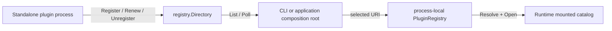

# Plugin registry and discovery

The registry is a control plane for independently running plugin instances. It
does not load plugins and it does not change a running Runtime by itself.

Three catalogs have deliberately different ownership:



- `registry.Directory` stores leased, discoverable instances shared by
  processes.
- `sdk.PluginRegistry` stores local names and transport URIs selected by one
  application.
- the Runtime catalog contains only resources installed by mounted plugin
  connections.

Discovery therefore never implies execution.

## Identity and leases

An active instance is identified by:

```text
(namespace, plugin name, instance ID)
```

Several instances may share the same plugin name. Registering the same complete
key twice conflicts. A successful registration returns:

- an opaque lease ID;
- a secret lease token used by Renew and Unregister;
- an epoch that increases when the same instance key is registered again;
- an expiry time.

The token is never returned by List, Get, or Poll. Standalone Go plugin hosts
generate an instance ID by default and accept explicit deployment metadata:

```bash
agentm-plugin-file \
  --listen 127.0.0.1:9001 \
  --registry-uri grpc://127.0.0.1:9090 \
  --registry-namespace default \
  --instance-id file-node-a \
  --label zone=local \
  --lease-ttl 30s
```

Other languages use the same `pluginrpc.v1.RegistryService` protocol and do
not import the Go SDK.

## Run a registry

The default command listens on loopback and persists beneath
`~/.ag/registry`:

```bash
ag registry serve
```

Use an ephemeral port and machine-readable startup record:

```bash
ag registry serve --listen 127.0.0.1:0 -o json
```

The ready document contains `uri`, `listen`, `backend`, `capabilities`, and
`pid`. Logs and OpenTelemetry diagnostics stay on stderr.

For a wildcard listener, set a client-facing URI explicitly:

```bash
ag registry serve \
  --listen 0.0.0.0:9090 \
  --advertise-uri grpcs://registry.example.com:9090 \
  --tls-cert /run/secrets/registry.crt \
  --tls-key /run/secrets/registry.key
```

The gRPC server exposes the standard health service and is instrumented by the
OpenTelemetry gRPC stats handler.

## Backends

| Backend URI | Scope | Durable | Multi-process | Distributed |
|---|---|---:|---:|---:|
| `memory://local` | one registry process | no | no | no |
| `file:///absolute/path` | one host | yes | yes on Unix | no |
| `etcd://host:2379/prefix` | etcd cluster | yes | yes | yes |
| `etcds://host:2379/prefix` | TLS etcd cluster | yes | yes | yes |

The file backend uses a lock file, atomic rename, file/directory sync, and
`0600` state permissions. It is intended for local development and one-host
deployments.

The etcd backend uses transactions, native leases, revision watches, and
compaction detection. Repeated `endpoint=` query parameters add cluster
endpoints; `dial_timeout=` changes the client dial timeout. `server_name=` is
accepted only with `etcds://`.

```text
etcd://node-a:2379/ag/registry?endpoint=node-b%3A2379&dial_timeout=5s
```

Registry URIs reject embedded credentials so passwords cannot leak through
config display or logs. Embedded applications can construct `EtcdConfig`
directly when they need username/password or a custom `tls.Config`.

## Discover and select

List active instances in the configured namespace:

```bash
ag plugin discover
ag plugin discover --name file
ag plugin discover --name file --label zone=local
ag plugin discover --resource tool:read_file -o json
```

An explicit remote entry has one of two forms:

```text
name=grpc://host:port
name[@instance-id]
```

Examples:

```bash
ag run --file=false \
  --plugin file@file-node-a \
  --prompt "Inspect the workspace"

ag plugin inspect file@file-node-a
```

When a plain name has exactly one active instance, `--plugin file` selects it.
When several instances are active, the CLI fails with copyable
`name@instance=uri` candidates. It never chooses a replica implicitly.

## Poll and recovery

`Poll` is revision-based and bounded by both context and `wait`. It may return
an empty `changes` array with a newer `next_revision`. This means an unrelated
instance or a lease heartbeat advanced the control-plane cursor; consumers
must save the new revision and poll again.

The normal consumer loop is:

1. call List and build a complete snapshot;
2. save the List response revision;
3. call Poll with that revision;
4. apply returned changes and persist `next_revision`;
5. repeat.

If etcd has compacted the requested history, Poll returns a cursor-expired
error. Rebuild from List and continue from the new snapshot revision. Never
silently skip to the latest revision.

## Configuration

```toml
[plugins]
remote = []
registry_uri = "grpc://127.0.0.1:9090"
registry_namespace = "default"

[registry]
listen = "127.0.0.1:9090"
advertise_uri = ""
backend_uri = "file:///Users/example/.ag/registry"
tls_cert_file = ""
tls_key_file = ""
max_message_bytes = 0
```

`plugins.*` configures registry consumers. `registry.*` configures
`ag registry serve`.

## Real etcd test

The ordinary suite skips the external-etcd test unless an endpoint is
explicitly provided:

```bash
AG_TEST_ETCD_URI=etcd://127.0.0.1:2379/ag/registry \
  go test -race ./registry -run TestEtcdDirectoryRealServer -count=1
```

The test covers multi-instance registration, token fencing, lease replacement,
pagination, delete and expiry events, epoch increment, and compacted cursors.
